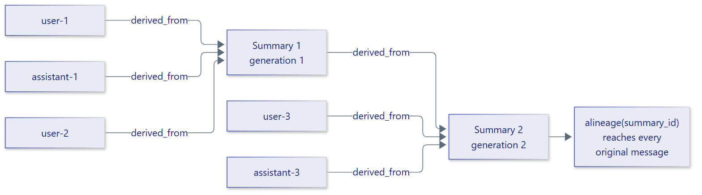

# Provenance and lineage

A summary replaces messages, so it should be possible to tell which messages
it came from. ContextSage records a `derived_from` link from every message a
summary replaces to that summary, in a
[langgraph-xai](https://pypi.org/project/langgraph-xai/) provenance store. When
a later summary replaces an earlier one, the earlier summary links to the new
one, so lineage reaches back across generations to the original messages.

<figure class="diagram" markdown="span">
  { width="720" }
  <figcaption>A summary of a summary keeps the full trail back to the
  original messages.</figcaption>
</figure>

## Summary identity

Every summary message gets a unique ID, reported as the event's `summary_id`,
and a `generation`: 1 for a summary of original messages, 2 for a summary
that also replaced a first-generation summary, and so on. The summary message
also records its generation and the summaries it replaced, so lineage keeps
working when the conversation is restored from a checkpoint.

## Query the lineage of a summary

`alineage` returns every upstream link of a summary, nearest first:

```python
--8<--
examples/provenance.py
--8<--
```

Output:

```text
--8<-- "examples/expected/provenance.txt"
```

Links are scoped to the LangGraph thread the summary was written in. For an
agent with a checkpointer, pass the thread with
`await middleware.alineage(summary_id, thread_id=...)`; agents without a
checkpointer share one default scope.

## Choose a store

By default, links go to a langgraph-xai `InMemoryProvenanceStore`, which keeps
them until the process exits. That suits development and tests. In
production, pass a durable store: subclass langgraph-xai's `ProvenanceStore`
and implement `write`, `get`, `query`, `parents` and `children` on your
database. The middleware's `provenance_store` property returns the store it
writes to:

```python
from langgraph_xai import InMemoryProvenanceStore

from contextsage import IntelligentSummarizationMiddleware

store = InMemoryProvenanceStore()  # use your durable ProvenanceStore here
middleware = IntelligentSummarizationMiddleware(
    model="openai:gpt-5-mini", provenance_store=store
)
print(middleware.provenance_store is store)
```

Output:

```text
True
```

Writing links is best effort: a store failure is logged as a warning and
never interrupts the agent.

## What a link records

| Field | Value |
| --- | --- |
| `source_id` | The ID of the replaced message or summary |
| `target_id` | The ID of the new summary |
| `relation` | `derived_from` |
| `context` | Application `contextsage`, tenant `default`, the graph ID, the thread ID and a run ID derived from the thread |
| `metadata` | `{"recorded_by": "contextsage"}` |

Only messages with an ID are linked. LangGraph assigns an ID to every message
added through the agent state, so in practice every message has one.
