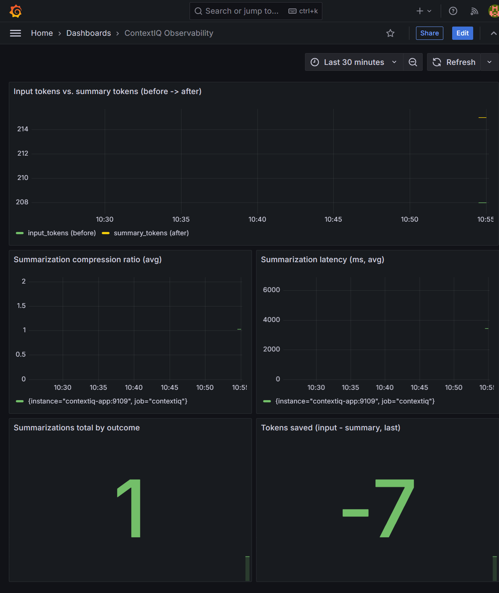
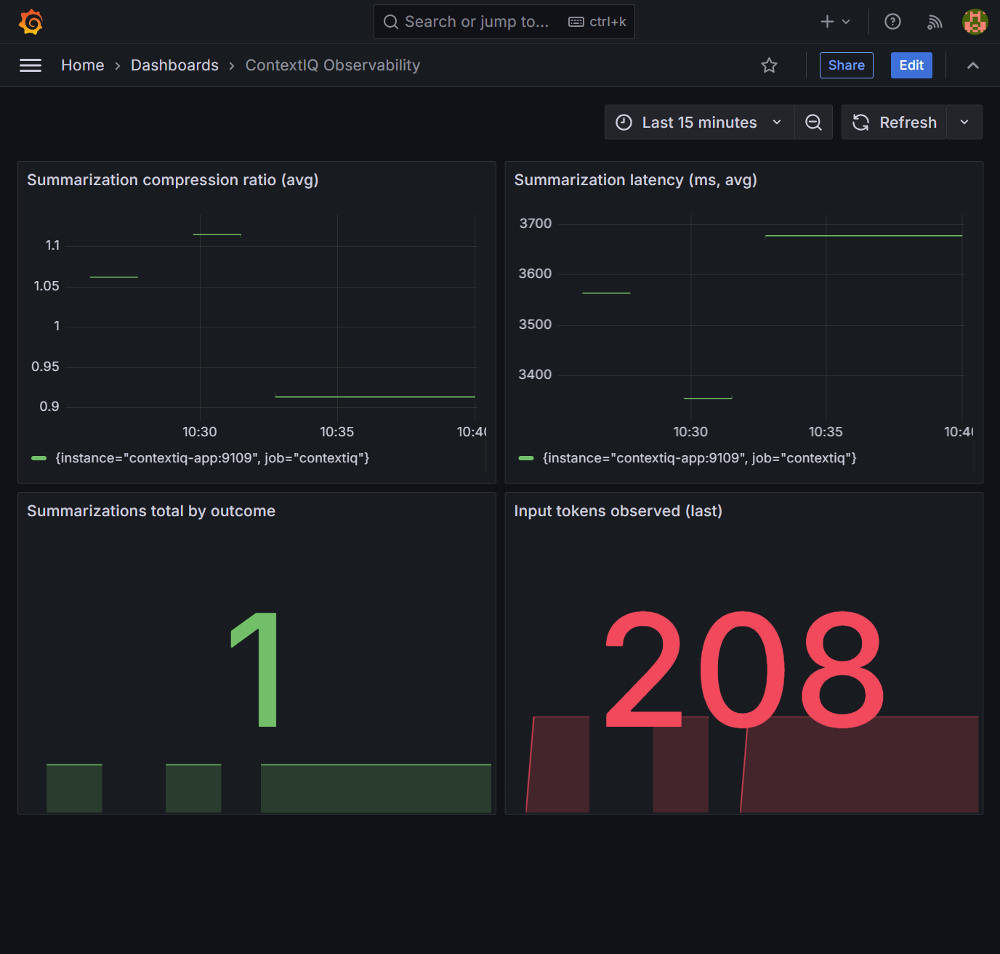

# Observability

Every summarization operation can emit a single `SummarizationEvent`
carrying only aggregate, non-sensitive fields:

```python
trigger_reason: str
input_tokens: int
available_tokens: int
overflow_tokens: int
selected_target_count: int
content_signal_counts: dict[str, int]
prepared_tokens: int
summary_tokens: int
compression_ratio: float
validation_status: str        # "skipped" | "passed" | "failed_recovered"
recovery_status: str          # "none_needed" | "none_applicable" | "append_preserved_facts" | "deterministic_trim_fallback"
fallback_used: bool
latency_ms: float
```

`validation_status` is `"skipped"` when `validation_enabled=False` (or when
the LLM summarization call itself failed, so no summary text existed to
validate), `"passed"` when every must-preserve fact and tool-call pairing
survived, and `"failed_recovered"` when validation caught missing facts and
`RecoveryManager` restated them — ContextSage never returns an unvalidated
summary silently as "failed" with no remediation.

`recovery_status` is `"none_needed"` when no recovery step ran,
`"none_applicable"` when validation failed but no literal facts could be
identified to restate, `"append_preserved_facts"` when a "preserved facts"
message was appended after a validation failure, and
`"deterministic_trim_fallback"` when the LLM summarization call itself
failed and ContextSage fell back to trimming plus a preserved-facts message.
`fallback_used` is `True` for the latter two.

## What is never included

Raw message content, tool outputs, and API keys are
**never** part of a `SummarizationEvent`. Only aggregate counts, ratios,
and status strings are recorded.

## Default behavior

By default (`observability_enabled=True`, the default), a
`LoggingObservabilityHook` logs one structured record per operation at
`INFO` level to the `contextsage.observability` logger, with the event
attached as `extra={"contextsage": event.as_dict()}` so structured-logging
setups (e.g. `python-json-logger`) can serialize it directly.

Set `observability_enabled=False` to install a `NullObservabilityHook`
instead (no-op).

## Custom hooks

Pass your own hook — any callable accepting a `SummarizationEvent` — via
`observability_hook=` to forward events to your own telemetry system
(metrics, tracing spans, a message queue, etc.) instead of the default
logger:

```python
from contextsage import IntelligentSummarizationMiddleware
from contextsage.observability.events import SummarizationEvent

def send_to_metrics(event: SummarizationEvent) -> None:
    my_metrics_client.record("contextsage.compression_ratio", event.compression_ratio)
    my_metrics_client.record("contextsage.latency_ms", event.latency_ms)

middleware = IntelligentSummarizationMiddleware(
    model=model,
    observability_hook=send_to_metrics,
)
```

See
[`examples/observability_prometheus.py`](https://github.com/smuniharish/contextsage/blob/main/examples/observability_prometheus.py)
for a complete, runnable hook that records every `SummarizationEvent` field
as Prometheus metrics and serves them on `/metrics` — verified end-to-end
against real Prometheus + Grafana containers
([`examples/observability_prometheus.yml`](https://github.com/smuniharish/contextsage/blob/main/examples/observability_prometheus.yml)
has the scrape config and exact commands to reproduce the stack).

## Tokens before vs. after summarization

`input_tokens` (tokens **before** summarization, at the point the trigger
fired) and `summary_tokens` (tokens **after** — the size of the produced
summary) are both on every `SummarizationEvent`, and their ratio
(`compression_ratio = summary_tokens / input_tokens`) is the single most
useful number for judging whether summarization is actually earning its
keep for a given workload: a compression ratio close to `1.0` means the
summary barely shrank the context (often because most content was
preserved verbatim as important), while a very small ratio means aggressive
reduction. `examples/observability_prometheus.py` records `input_tokens`
and `summary_tokens` as separate Prometheus histograms specifically so both
can be graphed side by side — not just the ratio — because "went from how
many tokens to how many tokens" is what you actually want to see on a
dashboard, not just a derived percentage.



The two series graphed here are real data from one run of the example
against a real LLM. Note the compression ratio in this particular run is
`~1.03` (`summary_tokens` slightly *larger* than `input_tokens`, so "tokens
saved" reads `-7`) — this is expected, not a bug: the demo conversation is
deliberately tiny (a couple of short messages, tuned to trigger
summarization quickly for the example), and there is a practical floor to
how concise an LLM-generated summary plus its preserved-facts restatement
can be. On realistic workloads — large tool outputs, logs, long
multi-turn histories — `input_tokens` is orders of magnitude larger and
the compression ratio drops well below `1.0`, as shown in the previous
dashboard screenshot (`~0.9` compression ratio, `latency_ms` ~3.4–3.7s,
against a real multi-message conversation with a genuine tool error to
compress).

## Example dashboard

A Grafana dashboard built from the metrics in
`examples/observability_prometheus.py`, showing real (non-synthetic) data
from an actual `IntelligentSummarizationMiddleware` run against a real LLM:


